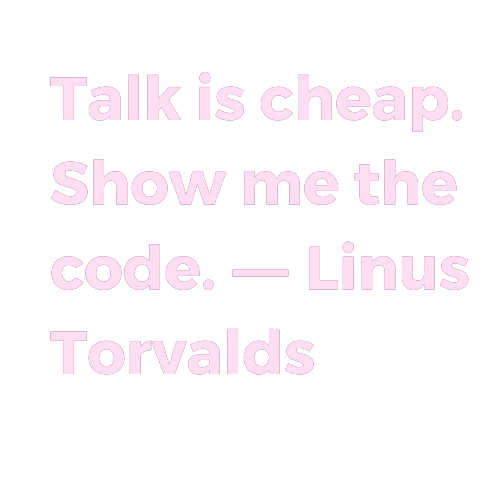

# Dumela 👋🏽 Lumela 👋🏽  Habari. Welcome to GitHub Profile :
I’m currently working on an exciting Dynamic React Dashboard Project & I'm currently learning the MERN STACK. Feel free to Ask me anything about Mobile & Web development.  

## 🌐 Socials:
    

# 💻 Tech Stack:
                        	      
# 📊 GitHub Stats:
 
 

## 🏆 GitHub Trophies

### 🔝 Top Contributed Repo

---

  ## 💰 You can help me by Donating
   

  
<!-- Proudly created with GPRM ( https://gprm.itsvg.in ) -->
